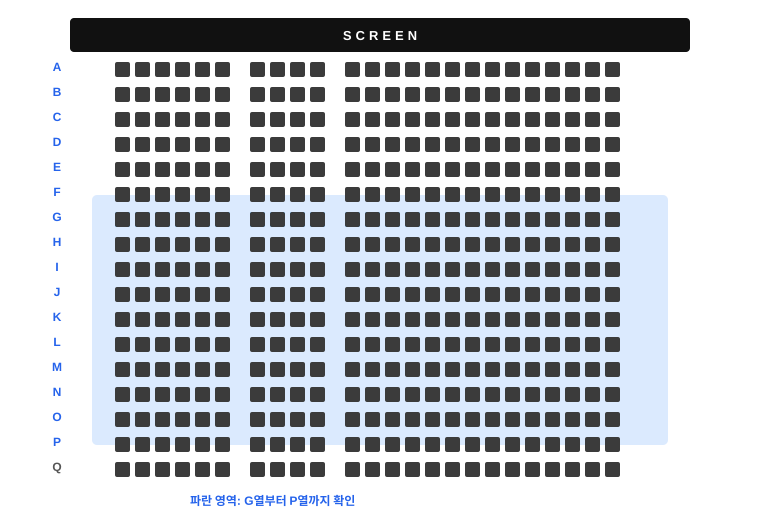

# CGV IMAX 좌석 알림

CGV 상영 일정과 빈 좌석을 확인해 이메일로 알려주는 서비스입니다.


## 알림 신청

[좌석 알림 신청하기](https://github.com/fullth/push-email-for-imax/issues/new?template=seat-alert.md)

신청 양식에 다음 정보를 입력해주세요.

- 수신 이메일
- 영화 제목
- 극장
- 상영관
- 관심 행 범위 (좌석표의 세로 행)
- 필요한 연속 좌석 수
- 확인할 상영 일정

예시:

```text
영화: 오디세이
극장: 용산아이파크몰
상영관: IMAX
관심 행 범위: G-P (G, H, I, J, K, L, M, N, O, P열)
필요한 연속 좌석 수: 2
대상 회차: 주말
```

`G-P`는 좌석표에서 **G열부터 P열까지**를 뜻합니다.



## 대상 회차

- `주말`: 최근 14일 안의 토요일과 일요일
- `평일`: 최근 14일 안의 월요일부터 금요일
- `전체`: 최근 14일의 모든 날짜

## 발송되는 알림

- `[CGV 상영 오픈]`: 새로운 상영일 또는 회차가 등록된 경우
- `[CGV 좌석 알림]`: 빈 좌석이 새로 생기거나 좌석 상태가 변경된 경우
- `ntfy`: 이메일보다 빠른 모바일 푸시 알림을 선택할 수 있음

좌석 알림에는 전체 좌석 배치도와 예매 화면 링크가 포함됩니다.

- 파란색: 예매 가능
- 진한 회색: 예매됨
- 회색: 선택 불가

Railway 워커가 약 1분마다 확인합니다. Railway 및 CGV 사정에 따라 실제 확인 시점이 늦어질 수 있으며, 좌석은 다른 예매자가 먼저 선택할 수 있습니다.

신청 양식에서 ntfy 알림을 선택하면 신청이 등록된 뒤 수신 이메일로 ntfy 구독 주소를 보내드립니다. ntfy 앱에서 해당 주소를 구독하면 상영 오픈과 빈자리 변경을 모바일 푸시로 받을 수 있습니다.

## 라이선스

이 프로젝트는 GNU AGPL-3.0 라이선스를 따릅니다. 자세한 내용은 [LICENSE](LICENSE)를 확인해주세요.
